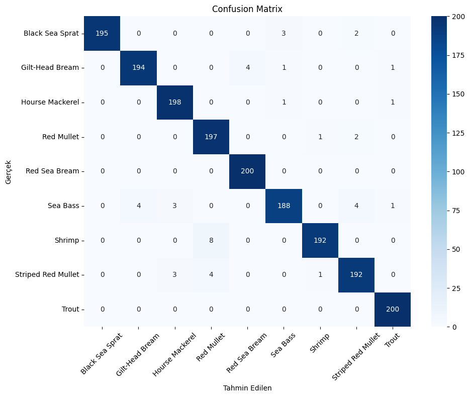
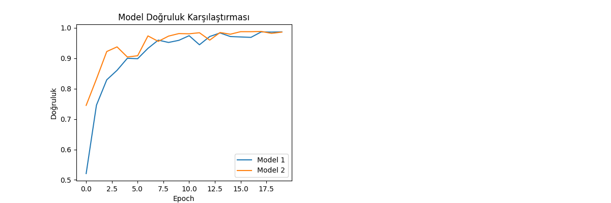
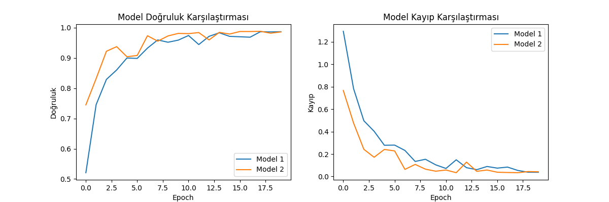

# Fish-Classification-Project
Balık türlerini sınıflandırmak için derin öğrenme modeli

# Balık Türü Sınıflandırma Projesi

## Proje Amacı
Bu proje, farklı balık türlerini sınıflandırmak için derin öğrenme tekniklerini kullanmaktadır.

## Kullanılan Teknolojiler
- Python
- TensorFlow/Keras
- Pandas
- Matplotlib

## Model Mimarisi
- 3 Convolutional katman
- MaxPooling katmanları
- Dropout (0.3)
- Dense katmanlar

## Sonuçlar
- Eğitim doğruluğu: %96.04
- Doğrulama doğruluğu: %98.68

### Confusion Matrix
Aşağıda modelin test seti üzerindeki tahminlerinin gerçek sınıflarla karşılaştırıldığı confusion matrix bulunmaktadır:

## Model Doğruluğu ve Kayıp Grafiği
Aşağıdaki grafikler, iki farklı modelin eğitim sürecindeki doğruluk ve kayıp değerlerini göstermektedir.

## Kaggle Notebook Linki
[Kaggle Notebook](https://www.kaggle.com/code/yasincanyilmazoglu/fishnclass)
